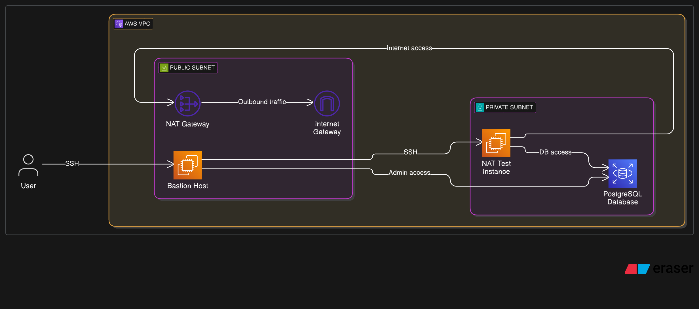

# Terraform AWS Infrastructure Project

## Overview

This project demonstrates a secure, modular AWS infrastructure provisioned using Terraform. It follows production-grade DevOps and Infrastructure as Code (IaC) principles, with a focus on reusability, environment separation, and remote state management.

Key components include:
- Modular Terraform architecture
- Multi-environment support (dev and prod)
- Remote backend with S3 and DynamoDB
- Core AWS services: VPC, EC2, RDS, S3, IAM



---

## Objectives

- Apply best practices in Terraform and AWS infrastructure automation
- Demonstrate Terraform module composition, lifecycle, and environment control
- Showcase production-ready architecture for cloud infrastructure deployment

---

## Architecture

The infrastructure includes:

- Custom VPC with public and private subnets
- EC2 instance in a public subnet with secure access
- RDS instance in a private subnet
- S3 bucket used for remote state and optionally data storage
- IAM roles and policies for least-privilege access control
- Workspace-based multi-environment deployment (dev, prod)

---

## Project Structure

```
terraform-aws-infrastructure/
├── backend-bootstrap/              # Bootstrap module for remote backend
│   ├── encryption.tf               # Server-side encryption config for S3
│   ├── main.tf                     # S3 bucket + DynamoDB resource definitions
│   ├── outputs.tf
│   ├── provider.tf
│   ├── README.md
│   ├── variables.tf
│   ├── versioning.tf               # Versioning config for S3
│   └── versions.tf
├── main/                           # Main infrastructure code
│   ├── backend.tf                  # Configures the remote backend
│   ├── provider.tf
│   ├── versions.tf
│   ├── variables.tf
│   ├── terraform.tfvars
│   └── modules/                    # Reusable modules
│       ├── vpc/
│       ├── ec2/
│       └── rds/
├── environments/                   # Environment-specific configurations
│   ├── dev/
│   └── prod/
└── README.md
```

---

## Usage

### Initialize Terraform with backend
```sh
terraform init
```

### Environment 

Each environment is deployed from the `main/` directory using env-specific tfvars and backend config.

### Deploy infrastructure
```
terraform plan
terraform apply
```
